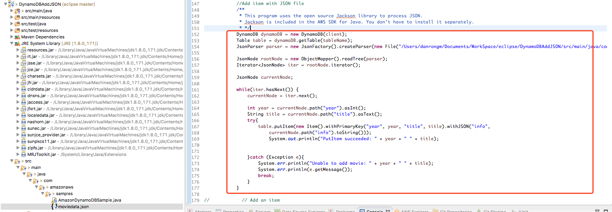
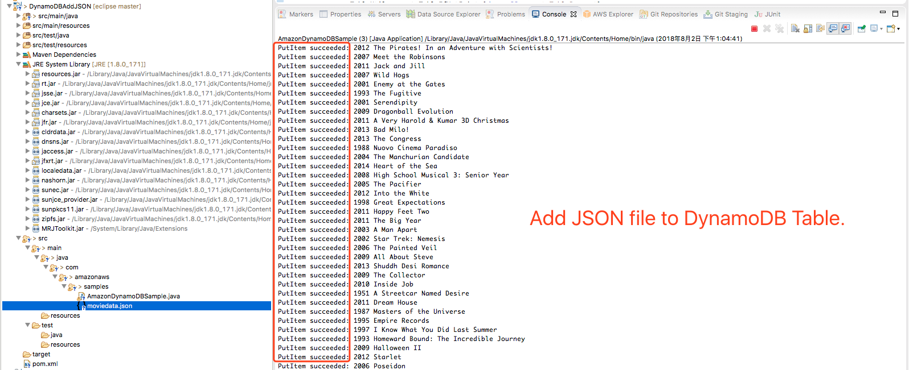
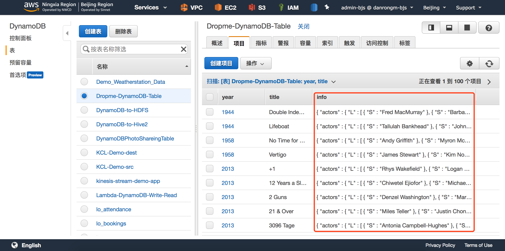

## **AWS DynamoDB存储JSON**

## 目的

DynamoDB操作JSON时，可以使用开源的 Jackson 库来处理。Jackson 包含在 AWS SDK for Java 中。不需要单独安装。






DynamoDB以JSON形式增加Item

```java
public static void main(String[] args) throws Exception {

    init();

    try {
        String tableName = "Dropme-DynamoDB-Table";

        // Create a table with a primary hash key named 'name', holds a number. range key named 'title', holds a string.
        System.out.println("Attempting to create table; please wait...");
        CreateTableRequest createTableRequest = new CreateTableRequest().withTableName(tableName)
            //Set DynamoDB Partition-Key
            .withKeySchema(new KeySchemaElement().withAttributeName("year").withKeyType(KeyType.HASH), 
                           //Set DynamoDB Range-Key
                           new KeySchemaElement().withAttributeName("title").withKeyType(KeyType.RANGE))
            //Set DynamoDB Partition-Key AttributeType
            .withAttributeDefinitions(new AttributeDefinition().withAttributeName("year").withAttributeType(ScalarAttributeType.N),
                                      //Set DynamoDB Range-Key AttributeType
                                      new AttributeDefinition().withAttributeName("title").withAttributeType(ScalarAttributeType.S))
            .withProvisionedThroughput(new ProvisionedThroughput().withReadCapacityUnits(5L).withWriteCapacityUnits(5L));

        // Create table if it does not exist yet
        TableUtils.createTableIfNotExists(dynamoDB, createTableRequest);
        // wait for the table to move into ACTIVE state
        TableUtils.waitUntilActive(dynamoDB, tableName); 

        // Describe our new table
        DescribeTableRequest describeTableRequest = new DescribeTableRequest().withTableName(tableName);
        TableDescription tableDescription = dynamoDB.describeTable(describeTableRequest).getTable();
        System.out.println("Table Description: " + tableDescription);

        //Add item with JSON file
        /**
                 * This program uses the open source Jackson library to process JSON. 
                 * Jackson is included in the AWS SDK for Java. You don't have to install it separately. 
                 * */
        DynamoDB dynamoDB = new DynamoDB(client);
        Table table = dynamoDB.getTable(tableName);
        JsonParser parser = new JsonFactory().createParser(new File("./moviedata.json"));

        JsonNode rootNode = new ObjectMapper().readTree(parser);
        Iterator<JsonNode> iter = rootNode.iterator();

        JsonNode currentNode;

        while(iter.hasNext()) {
            currentNode = iter.next();

            int year = currentNode.path("year").asInt();
            String title = currentNode.path("title").asText();
            try{
                table.putItem(new Item().withPrimaryKey("year", year, "title", title).withJSON("info",
                                                                                               currentNode.path("info").toString()));
                System.out.println("PutItem succeeded: " + year + " " + title);


            }catch (Exception e){
                System.err.println("Unable to add movie: " + year + " " + title);
                System.err.println(e.getMessage());
                break;
            }	
        }
    }
```



完整代码

```java
package com.amazonaws.samples;
import java.util.Arrays;

import java.util.HashMap;
import java.util.Iterator;
import java.util.Map;

import com.amazonaws.AmazonClientException;
import com.amazonaws.AmazonServiceException;
import com.amazonaws.auth.AWSCredentials;
import com.amazonaws.auth.profile.ProfileCredentialsProvider;
import com.amazonaws.client.builder.AwsClientBuilder;
import com.amazonaws.regions.Region;
import com.amazonaws.regions.Regions;
import com.amazonaws.services.dynamodbv2.AmazonDynamoDB;
import com.amazonaws.services.dynamodbv2.AmazonDynamoDBClientBuilder;
import com.amazonaws.services.dynamodbv2.document.DynamoDB;
import com.amazonaws.services.dynamodbv2.document.Item;
import com.amazonaws.services.dynamodbv2.document.Table;
import com.amazonaws.services.dynamodbv2.model.AttributeDefinition;
import com.amazonaws.services.dynamodbv2.model.AttributeValue;
import com.amazonaws.services.dynamodbv2.model.ComparisonOperator;
import com.amazonaws.services.dynamodbv2.model.Condition;
import com.amazonaws.services.dynamodbv2.model.CreateTableRequest;
import com.amazonaws.services.dynamodbv2.model.DescribeTableRequest;
import com.amazonaws.services.dynamodbv2.model.KeySchemaElement;
import com.amazonaws.services.dynamodbv2.model.KeyType;
import com.amazonaws.services.dynamodbv2.model.ProvisionedThroughput;
import com.amazonaws.services.dynamodbv2.model.PutItemRequest;
import com.amazonaws.services.dynamodbv2.model.PutItemResult;
import com.amazonaws.services.dynamodbv2.model.ScalarAttributeType;
import com.amazonaws.services.dynamodbv2.model.ScanRequest;
import com.amazonaws.services.dynamodbv2.model.ScanResult;
import com.amazonaws.services.dynamodbv2.model.TableDescription;
import com.amazonaws.services.dynamodbv2.util.TableUtils;
import com.fasterxml.jackson.core.JsonFactory;
import com.fasterxml.jackson.core.JsonParser;
import com.fasterxml.jackson.databind.JsonNode;
import com.fasterxml.jackson.databind.ObjectMapper;

import jdk.nashorn.internal.ir.ObjectNode;

import java.io.File;
/**
 * This sample demonstrates how to perform a few simple operations with the
 * Amazon DynamoDB service.
 */
public class AmazonDynamoDBSample {
    static AmazonDynamoDB dynamoDB;
    /**
     * The only information needed to create a client are security credentials
     * consisting of the AWS Access Key ID and Secret Access Key. All other
     * configuration, such as the service endpoints, are performed
     * automatically. Client parameters, such as proxies, can be specified in an
     * optional ClientConfiguration object when constructing a client.
     *
     * @see com.amazonaws.auth.BasicAWSCredentials
     * @see com.amazonaws.auth.ProfilesConfigFile
     * @see com.amazonaws.ClientConfiguration
     */
    private static void init() throws Exception {
        /*
         * The ProfileCredentialsProvider will return your [danrong-bjs]
         * credential profile by reading from the credentials file located at
         * (/Users/danrongm/.aws/credentials).
         */
        ProfileCredentialsProvider credentialsProvider = new ProfileCredentialsProvider();
        try {
            credentialsProvider.getCredentials();
        } catch (Exception e) {
            throw new AmazonClientException(
                    "Cannot load the credentials from the credential profiles file. " +
                    "Please make sure that your credentials file is at the correct " +
                    "location (/Users/danrongm/.aws/credentials), and is in valid format.",
                    e);
        }
        dynamoDB = AmazonDynamoDBClientBuilder.standard()
            .withCredentials(credentialsProvider)
            .withRegion("cn-north-1")
            .build();
    }

    public static void main(String[] args) throws Exception {
    	
        init();

        try {
            String tableName = "Dropme-DynamoDB-Table";

            // Create a table with a primary hash key named 'name', holds a number. range key named 'title', holds a string.
            System.out.println("Attempting to create table; please wait...");
            CreateTableRequest createTableRequest = new CreateTableRequest().withTableName(tableName)
            	//Set DynamoDB Partition-Key
                .withKeySchema(new KeySchemaElement().withAttributeName("year").withKeyType(KeyType.HASH), 
                		//Set DynamoDB Range-Key
                		new KeySchemaElement().withAttributeName("title").withKeyType(KeyType.RANGE))
                //Set DynamoDB Partition-Key AttributeType
                .withAttributeDefinitions(new AttributeDefinition().withAttributeName("year").withAttributeType(ScalarAttributeType.N),
                		//Set DynamoDB Range-Key AttributeType
                		new AttributeDefinition().withAttributeName("title").withAttributeType(ScalarAttributeType.S))
                .withProvisionedThroughput(new ProvisionedThroughput().withReadCapacityUnits(5L).withWriteCapacityUnits(5L));
            
            // Create table if it does not exist yet
            TableUtils.createTableIfNotExists(dynamoDB, createTableRequest);
            // wait for the table to move into ACTIVE state
            TableUtils.waitUntilActive(dynamoDB, tableName); 

            // Describe our new table
            DescribeTableRequest describeTableRequest = new DescribeTableRequest().withTableName(tableName);
            TableDescription tableDescription = dynamoDB.describeTable(describeTableRequest).getTable();
            System.out.println("Table Description: " + tableDescription);
            

            ProfileCredentialsProvider credentialsProvider = new ProfileCredentialsProvider();
            AmazonDynamoDB client = AmazonDynamoDBClientBuilder.standard()
            		.withCredentials(credentialsProvider)
                    //.withEndpointConfiguration(new AwsClientBuilder.EndpointConfiguration("http://localhost:8000", "us-west-2"))
                    .build();
            //Add item with JSON file
            /**
             * This program uses the open source Jackson library to process JSON. 
             * Jackson is included in the AWS SDK for Java. You don't have to install it separately. 
             * */
            DynamoDB dynamoDB = new DynamoDB(client);
            Table table = dynamoDB.getTable(tableName);
            JsonParser parser = new JsonFactory().createParser(new File("./moviedata.json"));

            JsonNode rootNode = new ObjectMapper().readTree(parser);
            Iterator<JsonNode> iter = rootNode.iterator();
           
            JsonNode currentNode;
            
            while(iter.hasNext()) {
            	currentNode = iter.next();
            	
            	int year = currentNode.path("year").asInt();
            	String title = currentNode.path("title").asText();
            	try{
                    table.putItem(new Item().withPrimaryKey("year", year, "title", title).withJSON("info",
                    	currentNode.path("info").toString()));
                        System.out.println("PutItem succeeded: " + year + " " + title);
            		
            		
            	}catch (Exception e){
                    System.err.println("Unable to add movie: " + year + " " + title);
                    System.err.println(e.getMessage());
                    break;
            	}	
            }
            
//            // DynamoDB写入一个item
//            Map<String, AttributeValue> item = newItem("Bill & Ted's Excellent Adventure", 1989, "****", "James", "Sara");
//            PutItemRequest putItemRequest = new PutItemRequest(tableName, item);
//            PutItemResult putItemResult = dynamoDB.putItem(putItemRequest);
//            System.out.println("Result: " + putItemResult);
//
//            // DynamoDB写入另一个item
//            item = newItem("Airplane", 1980, "*****", "James", "Billy Bob");
//            putItemRequest = new PutItemRequest(tableName, item);
//            putItemResult = dynamoDB.putItem(putItemRequest);
//            System.out.println("Result: " + putItemResult);
//
//            // 扫描 Scan items for movies with a year attribute greater than 1985
//            HashMap<String, Condition> scanFilter = new HashMap<String, Condition>();
//            Condition condition = new Condition()
//                .withComparisonOperator(ComparisonOperator.GT.toString())
//                .withAttributeValueList(new AttributeValue().withN("1985"));
//            scanFilter.put("year", condition);
//            ScanRequest scanRequest = new ScanRequest(tableName).withScanFilter(scanFilter);
//            ScanResult scanResult = dynamoDB.scan(scanRequest);
//            System.out.println("Result: " + scanResult);

        } catch (AmazonServiceException ase) {
            System.out.println("Caught an AmazonServiceException, which means your request made it "
                    + "to AWS, but was rejected with an error response for some reason.");
            System.out.println("Error Message:    " + ase.getMessage());
            System.out.println("HTTP Status Code: " + ase.getStatusCode());
            System.out.println("AWS Error Code:   " + ase.getErrorCode());
            System.out.println("Error Type:       " + ase.getErrorType());
            System.out.println("Request ID:       " + ase.getRequestId());
        } catch (AmazonClientException ace) {
            System.out.println("Caught an AmazonClientException, which means the client encountered "
                    + "a serious internal problem while trying to communicate with AWS, "
                    + "such as not being able to access the network.");
            System.out.println("Error Message: " + ace.getMessage());
        }
    }

//	private static Map<String, AttributeValue> newItem(String name, int year, String rating, String... fans) {
//        Map<String, AttributeValue> item = new HashMap<String, AttributeValue>();
//        item.put("name", new AttributeValue(name));
//        item.put("year", new AttributeValue().withN(Integer.toString(year)));
//        item.put("rating", new AttributeValue(rating));
//        item.put("fans", new AttributeValue().withSS(fans));
//
//        return item;
//    }
}
```